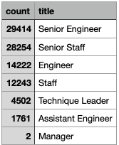

# Pewlett-Hackard-Analysis
## Overview
Determining the number of retiring employees per title, and identify employees who are eligible to participate in a mentorship program
## Results
- There is going to be a big loss in Senior Employees with Senior Engineer and Senior Staff being the top 2 categories from chart of retiring titles below
- Fortunately only 2 managers were up for retirement so managerial roles will not be an issue.
- Since there is not as much loss for entry and mid level workers. We have the ability to promote from within the company
- About 30% of the workforce is up for retirement.

## Summary
- About 90,000 jobs are closing in on retirement right now. A few things to look at is how we can hire within the company looking for a query of the amount of people not in senior level positions that could be promoted. Trying to push as many open jobs to entry level positions if it makes sense to do so. 
- Unfortunately the parameters of the people that qualify for the mentorship program is slim. Only about 1,500 people qualify, so we may want to revisit the parameters to open this up a bit more.
